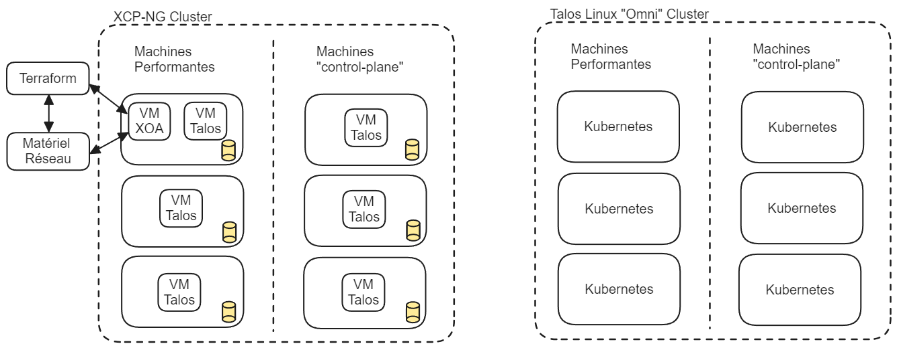

# Plateforme CEDILLE -  Rapport LOG791

## Introduction

Dans le cadre du cours LOG-791 et de notre engagement au sein du club Cedille de l'École de Technologie Supérieure (ÉTS), nous avons entrepris le projet de faire la conception et la mise en place de la Plateforme CEDILLE. Ce rapport vise à présenter de manière exhaustive les différentes étapes de notre initiative, depuis sa genèse jusqu'à sa concrétisation actuelle.

Le projet de la Plateforme CEDILLE avait pour objectif principal de transformer l'infrastructure existante du club. Nous avons choisi d'implémenter un cluster Kubernetes sur des serveurs physiques, en exploitant les capacités de Talos OS et la solution Omni de Sidero Labs. Cette démarche se voulait doublement bénéfique : réduire les coûts associés à l'hébergement tout en offrant une opportunité concrète d'apprentissage et de développement des compétences en DevOps, Kubernetes et gestion de serveurs.

Aujourd'hui, nous sommes fiers de constater que la majorité de l'infrastructure et des services systèmes sont opérationnels. Cependant, il convient de souligner que certaines phases de la migration des services hébergés restent à compléter. Ce rapport se propose donc de dresser un bilan de notre parcours, soulignant aussi bien les réussites que les obstacles rencontrés et les enseignements tirés de cette expérience.

Dans les sections suivantes, nous détaillerons la méthodologie adoptée pour la réalisation de ce projet, ainsi que les étapes de développement et de mise en œuvre. Nous mettrons en lumière les défis techniques et organisationnels rencontrés, ainsi que les solutions déployées pour les surmonter. Un éclairage sera également porté sur les alternatives technologiques envisagées, afin d'offrir une vision complète de nos choix et de notre processus de décision.

Nous analyserons ensuite les résultats obtenus, évaluant le succès du projet au regard des objectifs initiaux et des livrables. Un focus particulier sera accordé aux apprentissages et compétences développés tout au long du projet, témoignant de l'impact formateur de ce projet sur l'ensemble des membres de l'équipe. Enfin, la conclusion résumera nos principales réalisations et proposera des recommandations pour les futurs projets de nature similaire.

Par le biais de ce rapport, nous aspirons à vous fournir une vue d'ensemble exhaustive de notre parcours, mettant en évidence nos réalisations ainsi que les leçons clés tirées au cours de cette expérience.

## Méthodologie

Pour mener à bien le projet Plateforme CEDILLE, notre équipe d'étudiants a adopté une approche pratique et flexible, combinant des outils de collaboration modernes et des méthodes de travail adaptées à notre contexte étudiant.

### Planification initiale et vision du projet

Au début du projet, nous avons commencé par une phase de planification détaillée. Pour cela, on a utilisé un grand tableau pour visualiser l'ensemble de notre stack technologique et comprendre comment les différents éléments interagissaient entre eux. Cette étape a été cruciale pour nous aider à rédiger notre document de vision. Ce document a servi de feuille de route pour tout le projet, en définissant clairement nos objectifs et notre approche.

### Organisation du travail et backlog

Une fois notre vision établie, nous avons dressé une liste exhaustive de toutes les tâches à réaliser dans notre backlog sur GitHub. Cela nous a permis d'évaluer l'ampleur du projet et de diviser le travail en trois grandes itérations d'un mois chacune. Cette approche itérative nous a aidés à rester concentrés et à mesurer notre progression de façon régulière.

### Retrospectives et ajustements

Après chaque itération, on prenait le temps de faire une rétrospective. Ces moments étaient essentiels pour réfléchir à ce qui s'était bien passé et à ce qu'on pouvait améliorer pour la suite. Grâce à ces rétrospectives, on a pu ajuster notre planification et notre approche pour les itérations suivantes, en tirant des leçons de nos expériences précédentes.

### Documentation et suivi sur le wiki

Toute notre progression a été soigneusement documentée sur notre wiki. Pour chaque tâche ou problème rencontré, on créait une entrée sur le wiki avec des liens directs vers les issues correspondantes sur GitHub. Cela a permis à toute l'équipe de suivre facilement l'avancement du projet et de retrouver rapidement les informations pertinentes liées à chaque tâche.

### Réunions et communication

La communication constante et efficace a été un pilier de notre projet. Nous avons organisé des séances de travail en présentiel chaque dimanche à l'école pour une collaboration et des discussions techniques approfondies. En complément, des réunions hebdomadaires sur le modèle Scrum étaient tenues tous les lundis, permettant à l'équipe de discuter des avancées, de planifier les prochaines étapes et de résoudre les obstacles rencontrés.

### Adoption des principes Agile et DevOps

Notre processus de collaboration a été fortement influencé par les principes Agile et DevOps. Nous avons adopté une approche itérative pour le développement, permettant une adaptation et une réactivité rapides aux changements. Le déploiement continu et les mises à jour de notre architecture ont été gérés via l'Infrastructure as Code (IaC), en utilisant des pipelines CI/CD pour automatiser et rationaliser ces processus. De plus, l'utilisation de templates pour les issues et pull requests sur GitHub a renforcé notre efficacité et a maintenu une norme de clarté et de cohérence dans notre communication et nos pratiques de développement.

## Architecture technique

## Autres solutions envisagés

Pendant la phase d'analyse, on a identifié que certains choix techniques pouvaient être réalisés de plusieurs façons. Ainsi, dans le document de vision, on a identifié ces options et on s'est prononcé sur un choix initial (Tableau 4.4.2). Cependant, la phase d'implémentation nous a permis d'avoir une meilleure perspective sur certains choix et la possibilité de les changer. Ainsi, on présente ces choix ici:

### Choix de l'engin de stockage

Selon le CAR8, on a planifié d'utiliser Rook-Ceph comme engin de stockage pour Kubernetes. À titre de rappel, l'engin est responsable de fournir un service qui répond aux requêtes CSI dans Kubernetes afin d'allouer des espaces dédiés au pods, d'assurer que ces espaces sont accessibles dans tout le cluster et que les données soient durables et intègres.

Rook-Ceph est une extension de Ceph, qui est un système de stockage distribué qui prédate Kubernetes. En principe, ce dernier répond à tous nos besoins en termes d'engin. Cependant, en pratique, on a remarqué que le système était très instable à notre échelle (3 serveurs).

Après plusieurs essais, on a choisi de remplacer Rook-Ceph par Mayastor, qui est un système conçu dès le début pour Kubernetes. Au final, le déploiement était plus simple et le système est très stable.

### Choix de l'engin de gestion des secrets

Étant donné le fait que notre répertoire de code est public et qu'on utilise l'approche GitOps, il est impératif qu'aucun secret ne soit divulgué dans le répertoire de code source. Ainsi, il nous faut une solution logicielle qui fait abstraction des secrets afin de les gérer de manière sécuritaire. Donc, les deux choix principaux pour le faire sont Hashicorp Vault vs Bitnami Sealed Secrets.

Bitnami Sealed Secrets: Les secrets sont quand même présents dans git, mais ils sont cryptés.
HashiCorp Vault: Les secrets ne sont pas dans Git, mais leurs configurations et des références le sont. Il offre aussi plusieurs modes de cryptage avancés, la génération dynamique, la rotation automatique et plusieurs autres fonctionnalités avancées.

Ainsi, on a déterminé que Vault serait une meilleure solution pour ce projet puisqu’on le juge plus sécuritaire (puisqu’aucun secret n’est divulgué publiquement comme dans le cas de sealed-secrets) et qu'on aurait besoin des fonctions plus avancées qu'il nous offre.

### Choix d'utilisation d'un Hypervisor

Avant la phase d'analyse et rédaction du document de vision, on a entrepris une phase d'installation et configuration du matériel physique. Dans cette phase, on avait essayé en premier d'utiliser l’hyperviseur XCP-NG comme système d'exploitation principal, le plan étant de configurer nos clusters Kubernetes avec des machines virtuelles.

Afin de respecter notre objectif d'utiliser des configurations déclaratives le plus possible, on devait faire une gestion exhaustive de l’hyperviseur, de son réseau et de son stockage avec Terraform. Ainsi, on n'était pas prêt à accepter le niveau de complexité qui aurait été ajouté par cette méthode, donc on a choisi d'installer Talos Linux directement sur les machines sans Hypervisor.

Le résultat final est que la majorité des configurations et installations sont faites nativement dans le cluster Kubernetes, ce qui offre un haut niveau de cohérence dans le code du projet.

**Figure: Comparaison des moyens de déploiement**

## Défis et Solutions

| Défi     | Problème| Solution| 
| -------- | ------- | ------- |
| Installation de Kubernetes/Talos           | Cryptage des disques non fonctionnel                          | Désactivation du cryptage avant installation
|                                            | Installation brisée si clé USB retirée                        | Réinstallation avec identifiants de disque durables
| Configuration d'ISO dans PVC pour KubeVirt | Besoin de simplifier la gestion des PVCs                      | Utilisation du CDI de KubeVirt
| Installation de Rook-Ceph                  | Cluster Ceph inutilisable, échec des OSD                      | Effacement manuel des disques et redémarrage de l'opérateur
| Stabilité de Rook/Ceph                     | Instabilité après redémarrage d'un node                       | Remplacement par Mayastor
| Configuration d'un service mesh            | Problèmes avec Linkerd et mTLS                                | Choix de Kuma pour mTLS et support de Gateway API
| Installation du service External-DNS       | Service non fonctionnel, cause inconnue	                     | Enquête en cours, exploration de solutions alternatives
| Configuration SSO pour ArgoCD              | Gestion non sécurisée des secrets                             | Utilisation de Vault pour la gestion sécurisée des secrets
| Bootstrapping de Hashicorp Vault           | Processus manuel complexe                                     | Automatisation partielle via Terraform et scripts
| Déploiement de Calidum-rotae               | Acheminement partiel des requêtes                             | Configuration directe d'une webhook Discord
| Enregistrement de VCluster dans ArgoCD     | Difficulté d'enregistrement sécurisé                          | Utilisation de Crossplane pour enregistrement déclaratif

## Résultats

Notre projet a connu une progression significative, marquée par une série de tâches réalisées avec succès, chacune contribuant de manière essentielle à l'avancement global. Voici un résumé des tâches accomplies, présentées dans l'ordre chronologique de leur réalisation ainsi que par livrable :

### Livrable 1: Phase initiale de préparation et d'entrevues. Déploiement et configuration initiale

- Préparation de questionnaires spécifiques à chaque client et conduite d'entrevues avec divers clubs et services de l'ÉTS, notamment AlgoETS, Raconteurs d'Angles, Saveurs de Génie, et les services TI. Ces entrevues ont permis de définir les métriques de succès du projet.
- Mise en place du cluster physique avec Talos/Omni et configuration de base de Rook/Ceph. Evaluation de la stack de networking pour Kubernetes.
- Création d'un wiki pour centraliser la documentation et rédaction du document de vision initial.
- Migration physique des serveurs vers la salle de serveurs et configuration de KubeVirt.

### Livrable 2: Développement et configuration avancée

- Déploiement d'un cluster sandbox avec Vcluster, installation et configuration de l'external-dns, Hashicorp Vault, et Crossplane sur le cluster.
- Mise en place de la structure Kustomize, configuration d'ArgoCD, Contour (reverse-proxy/ingress), et déploiement de Kuma + Merbridge (service-mesh).
- Configuration et déploiement de Grafana, Gateway API, et Mayastor.
- Documentation approfondie de KubeVirt, Kuma, Merbridge, et Contour.

### Livrable 3: Finalisation et optimisation

- Déploiement de cert-manager, documentation de Mayastor et de la configuration d'environnement locale avec Omni.
- Configuration d'OTEL, suivi de Clickhouse avec Open Telemetry, et déploiement d'exemples d'applications comme Grav et Calidum-Rotae.
- Mise à jour de l'architecture dans le README.md, suppression de composants obsolètes (base de données PostgreSQL, numéro de téléphone dans le protobuf), et instrumentation de l'application avec OTEL.

### Tâches en cours et non réalisées

Bien que de nombreuses tâches aient été menées à bien, certaines sont encore en cours, notamment le déploiement de cert-manager et la documentation de Vault. Par ailleurs, l'intégration des vclusters avec ArgoCD est en cours de réalisation.

En termes de tâches non réalisées, nous avons décidé de ne pas poursuivre l'installation/configuration de k8s-sigs/external-dns dans le cluster, en raison de contraintes spécifiques au projet.

### Résultat final

Notre projet a conduit à l'établissement d'une plateforme de déploiement capable de gérer une variété de services. Cette plateforme marque un progrès dans notre façon de déployer, gérer et surveiller les services informatiques, offrant une solution qui répond aux besoins variés de chaque club.

Pour des applications web, des bases de données ou des services de backend, elle fournit la flexibilité et les capacités nécessaires pour une gestion efficace et sécurisée des déploiements. Avec des outils tels qu'ArgoCD et Kustomize, le processus de déploiement est automatisé, facilitant des mises à jour et une maintenance continues.

Dans le domaine de l'observabilité et du monitoring, la plateforme intègre OpenTelemetry, Grafana et Clickhouse, offrant une vue complète sur les performances et l'état de santé de chaque service déployé. Cette capacité de surveillance est essentielle pour identifier rapidement les problèmes et optimiser les performances.

La gestion des secrets est gérée par l'implémentation de Hashicorp Vault, offrant une approche centralisée et sécurisée qui améliore la sécurité des services et simplifie les processus opérationnels.

La plateforme permet également de créer des environnements isolés avec Vcluster, bénéfique pour les développeurs des différents clubs. Ils peuvent tester et développer dans des environnements séparés sans impacter l'infrastructure principale. Cette fonctionnalité favorise une approche de développement anticipatif, où les tests et la détection des erreurs se font plus tôt dans le cycle de développement.

La gestion du HTTPS et de l'ingress est assurée par Cert-Manager et Contour, fournissant une configuration sécurisée pour l'accès aux services. Cette combinaison assure l'accessibilité et la sécurité des services déployés, avec une gestion automatisée des certificats SSL/TLS.

## Apprentissages et Compétences Acquises

## Thomas

Dans le projet Plateforme Cedille, j'ai pris en charge la configuration d'OpenTelemetry, incluant le collecteur et l'opérateur, enrichissant ainsi ma compréhension de l'observabilité des systèmes. En parallèle, j'ai utilisé mes compétences en Golang pour intégrer des traces dans l'application calidum-rotae, en appliquant les principes du tracing distribué pour optimiser le monitoring et le débogage. J'ai également appris à utiliser Clickhouse pour le stockage et l'analyse des données collectées d'OpenTelemetry, et Grafana pour leur visualisation. Cette combinaison d'OpenTelemetry, Clickhouse et Grafana a créé un écosystème de monitoring complet, me permettant de voir comment ces technologies interagissent et se complètent. 

## Jonathan

## Michael

Avec ce projet, j'ai eu l'opportunité d'apprendre comment utiliser et concevoir une bonne structure de projet avec Kustomize. Également, j'ai appris comment utiliser ArgoCD pour déployer des applications selon l'approche GitOps. J'ai aussi collaboré avec mes coéquipiers sur les autres aspects du projet, ce qui a été une bonne occasion de pratiquer mes habiletés en communication et en travail d'équipe. Ce qui est de plus grande valeur pour ce projet est le fait qu'on a bâti un tout nouveau système, en équipe. Ainsi, on a débuté avec une idée initiale, discutée, analysée, décidée, architecturée et implémenté chaque niveau du système, ce qui est une expérience de valeur incalculable.

## Simon

## Conclusion

Synthèse des principaux apprentissages, réalisations, et recommandations pour des projets futurs.

## Annexes

Tout matériel supplémentaire pertinent, tel que des graphiques, des tableaux de données, des images, etc.

---
